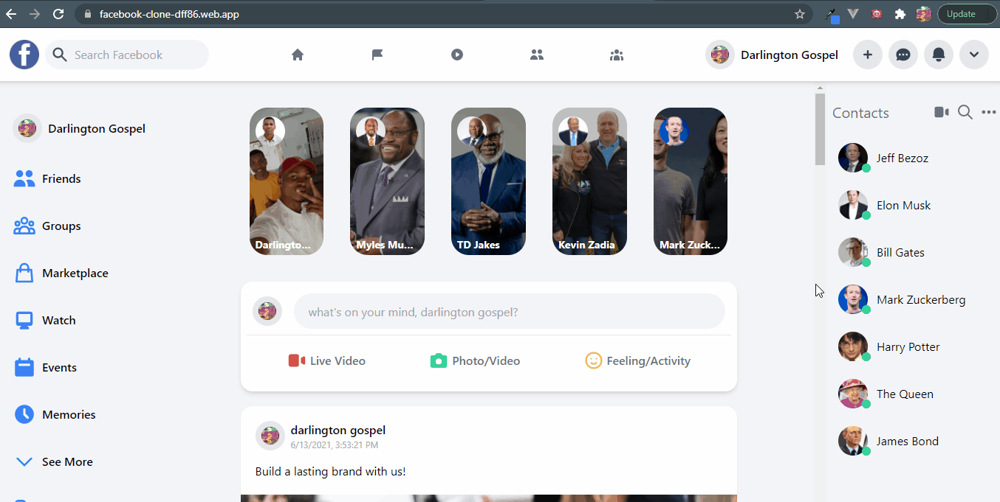
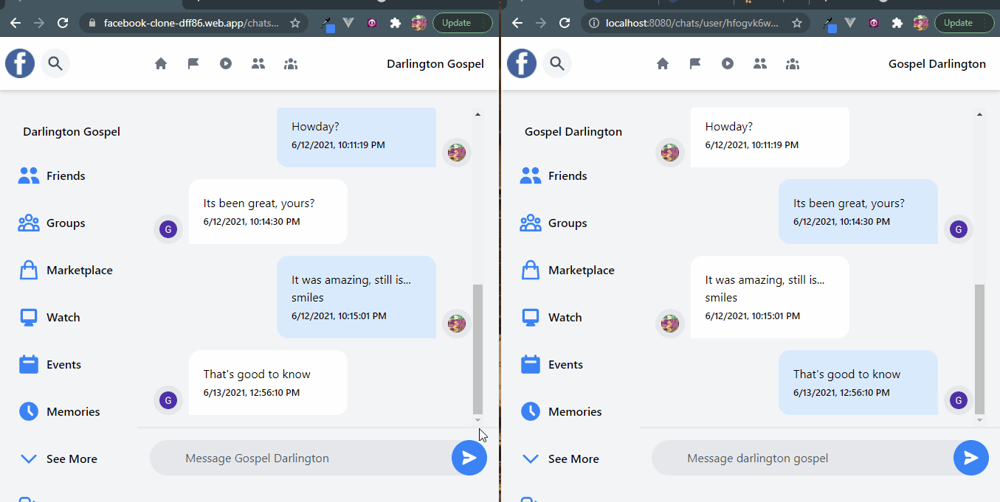

# How to Build a Social Networking site with VueJs (Facebook Clone)

Read the full tutorial here: [**>> How to Build a Social Networking site with VueJs (Facebook Clone)**](https://www.cometchat.com/tutorials/#)

This example shows How to Build a Social Networking site with VueJs (Facebook Clone):


<center><figcaption>Facebook Clone</figcaption></center>


<center><figcaption>Facebook Clone Chat Screen</figcaption></center>

## Technology

This demo uses:

- CometChat Pro 2.3.0
- Firebase
- VueJs 3
- Tailwind CSS
- Heroicons

## Running the demo

To run the demo follow these steps:

1. [Head to CometChat Pro and create an account](https://app.cometchat.com/signup)
2. From the [dashboard](https://app.cometchat.com/apps), add a new app called **"facebook-clone"**
3. Select this newly added app from the list.
4. From the Quick Start copy the **APP_ID, APP_REGION and AUTH_KEY**. These will be used later.
5. Also copy the **REST_API_KEY** from the API & Auth Key tab.
6. Navigate to the Users tab, and delete all the default users and groups leaving it clean **(very important)**.
7. Download the repository [here](https://github.com/Daltonic/facebook-clone/archive/master.zip) or by running `git clone https://github.com/Daltonic/facebook-clone.git` and open it in a code editor.
8. [Head to Firebase and create a new project](https://console.firebase.google.com)
9. Create a file called **app.config.js** in the **src** folder of your project.
10. Import and inject your secret keys in the **app.config.js** file containing your CometChat and Firebase in this manner.

```js
// For Firebase JS SDK v7.20.0 and later, measurementId is optional
const firebaseConfig = {
  apiKey: 'xxx-xxx-xxx-xxx-xxx-xxx-xxx-xxx',
  authDomain: 'xxx-xxx-xxx-xxx-xxx-xxx-xxx',
  databaseURL: 'xxx-xxx-xxx-xxx-xxx-xxx-xxx-xxx-xxx',
  projectId: 'xxx-xxx-xxx',
  storageBucket: 'xxx-xxx-xxx-xxx-xxx',
  messagingSenderId: 'xxx-xxx-xxx',
  appId: 'xxx-xxx-xxx-xxx-xxx-xxx-xxx-xxx',
  measurementId: 'xxx-xxx-xxx',
}

const cometChatConfig = {
  APP_ID: 'xxx-xxx-xxx',
  AUTH_KEY: 'xxx-xxx-xxx-xxx-xxx-xxx-xxx-xxx',
  REST_KEY: 'xxx-xxx-xxx-xxx-xxx-xxx-xxx-xxx',
  APP_REGION: 'xx',
}

export { firebaseConfig, cometChatConfig }
```

11. Make sure to exclude **app.config.js** in your gitIgnore file from being exposed online.
12. Run the following command to install the app.

```sh
    npm install
    npm run serve
```

Questions about running the demo? [Open an issue](https://github.com/Daltonic/facebook-clone/issues). We're here to help ✌️

## Useful links

- 🏠 [CometChat Homepage](https://app.cometchat.com/signup)
- 🚀 [Create your free account](https://app.cometchat.com/apps)
- 📚 [Documentation](https://prodocs.cometchat.com)
- 👾 [GitHub](https://www.github.com/cometchat-pro)
- 🔥 [Firebase](https://console.firebase.google.com)
- 🔷 [VueJs](https://vuejs.org/)
- ✨ [Live Demo](https://facebook-clone-dff86.web.app/)
